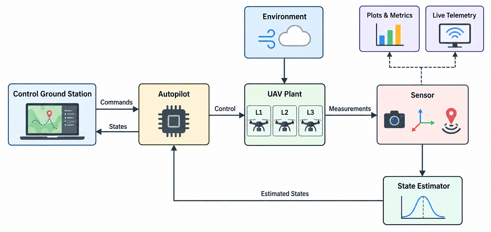
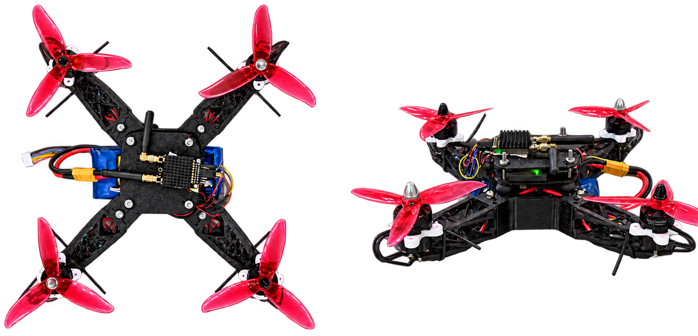

# UAV Research Environment: How Much Plant Fidelity Does Closed-Loop Quadrotor Evaluation Need? A Parameter-Consistent Study

<p align="center">
  
  <a href="https://www.mathworks.com/products/matlab.html"></a>
  <a href="https://www.mathworks.com/products/simulink.html"></a>
  <a href="LICENSE"></a>
</p>

---

## Introduction

This repository provides a MATLAB/Simulink environment for evaluating quadrotor controllers across three plant-model fidelity levels while keeping the main experimental conditions as consistent as possible.

The framework compares:

- **L1 — Analytical ODE model**
- **L2 — Simulink block-based model**
- **L3 — Simscape physical model**

The same reference vehicle, controller architecture, estimator, sensors, missions, disturbance conditions, and evaluation methodology are maintained across the plant models whenever possible.

The objective is to determine when increased plant-model fidelity materially changes closed-loop engineering conclusions and whether the additional detail justifies its computational cost.

---

## Framework Overview

The main model is:

```text
UAV_Research_Environment.slx
```

The framework integrates:

- Multi-fidelity plant models
- Cascaded quadrotor control
- Sensor models
- State estimation
- Mission and trajectory generation
- Environmental disturbances
- Landing and ground-contact logic
- Performance logging and visualization

The three plant models share a common high-level architecture so that plant fidelity can be changed without redesigning the complete control and evaluation workflow.

<p align="center">
  
</p>

---

### Custom Quadrotor Platform



Custom quadrotor platform used as the common physical basis for the L1, L2, and L3 plant representations.

---

## Demonstration Videos

**Live 3D simulation:** Demonstration of the quadrotor simulation with real-time 3D trajectory visualization and live flight-state monitoring.

https://github.com/user-attachments/assets/d6790151-9e39-4fb8-8c10-a079a4a77ccb


**Simscape Multibody visualization:** Demonstration of the L3 physical model running in Simscape Multibody using Mechanics Explorer.

https://github.com/user-attachments/assets/7224ec8a-1ad8-4c33-ae24-2b3d28b6e54e


---

## Requirements

The framework was developed and tested using **MATLAB R2025a** on Windows 11.

### Required MATLAB Products

- MATLAB
- Simulink
- Simscape
- Simscape Multibody
- Aerospace Toolbox
- Aerospace Blockset
- UAV Toolbox
- Navigation Toolbox
- Control System Toolbox
- Statistics and Machine Learning Toolbox

`Simscape` and `Simscape Multibody` are required for the L3 physical model, `Global Optimization Toolbox` is used by the controller and estimator tuning workflows, and `Statistics and Machine Learning Toolbox` is used for the statistical analysis of the computational-cost results.

---

## Getting Started

Clone this repository using Git.


### Selecting a Trajectory

The trajectory library is defined in:

```text
UAV_trajectories.m
```

Select the desired trajectory by setting `TRAJECTORY_ID` before running the project initialization:

```matlab
TRAJECTORY_ID = uint8(1);
initialize_project
```

The available trajectory IDs are defined directly in `UAV_trajectories.m`.

After initialization, open the main model:

```matlab
open_system('UAV_Research_Environment')
```

Update the model with `Ctrl + D` if required, then press **Run**.

---
## Reproducibility and Technical Configuration

This section documents the configuration used for the experiments reported in the paper. Source files remain the authoritative implementation reference.

### Experimental Campaign

| Item | Configuration |
|---|---|
| Primary campaign | L1(C1), L2(C1), L3(C2) × T1/T2 × D0/D1 |
| Primary runs | 12 |
| Sensitivity runs | L3(C1) on T1-D1 and T2-D1 |
| Simulation horizon | 130 s |
| Control/estimation rate | 200 Hz |
| GPS rate | 10 Hz |
| Magnetometer fusion rate | 20 Hz |
| Barometer rate | 20 Hz |

C1 is used for L1 and L2, while C2 is used for L3. In the two supplementary sensitivity runs, C1 is transferred to L3 unchanged.

### Controller Gains

The values below are the frozen campaign gains used to produce the paper results.

#### C1 — L1 and L2

Campaign source: `FINAL_C1_FROZEN_2026-09-12`. Tuning artifacts: `ICRA2027 results/Controller_Tuning/Results_C1/Controller_Tuning_C1_2026-09-11_20-09-10`.

| Loop | Type | Gains |
|---|---|---|
| North position | P | `Kp = 0.630229618` |
| East position | P | `Kp = 0.922964404` |
| Body-X velocity | PD | `Kp = 2.278801060`, `Kd = 0.012960081`, `N = 1.890174530` |
| Body-Y velocity | P | `Kp = 0.957100556` |
| Vertical position | P | `Kp = 0.292511837` |
| Vertical velocity | P | `Kp = 179.235177724` |
| Yaw angle | P | `Kp = 14.605949532` |
| Roll attitude | P | `Kp = 19.699174304` |
| Pitch attitude | P | `Kp = 23.969234502` |
| Roll rate | PI | `Kp = 192.002243651`, `Ki = 36.716674044` |
| Pitch rate | PI | `Kp = 116.955688321`, `Ki = 324.349522335` |
| Yaw rate | PI | `Kp = 513.270796124`, `Ki = 48.966894919` |

#### C2 — L3

Campaign source: `FINAL_C2_L3_VALIDATED_2026-09-11`. Tuning artifacts: `ICRA2027 results/Controller_Tuning/Results_C2/Controller_Tuning_C2_2026-09-12_19-23-03`.

| Loop | Type | Gains |
|---|---|---|
| North position | P | `Kp = 0.630229618` |
| East position | P | `Kp = 0.922964404` |
| Body-X velocity | PD | `Kp = 2.278801060`, `Kd = 0.012960081`, `N = 1.890174530` |
| Body-Y velocity | P | `Kp = 0.957100556` |
| Vertical position | P | `Kp = 0.292511837` |
| Vertical velocity | P | `Kp = 179.235177724` |
| Yaw angle | P | `Kp = 14.605949532` |
| Roll attitude | P | `Kp = 5.000000000` |
| Pitch attitude | P | `Kp = 23.969234502` |
| Roll rate | PI | `Kp = 20.000000000`, `Ki = 36.105000000` |
| Pitch rate | PI | `Kp = 22.9527`, `Ki = 22.0677` |
| Yaw rate | PI | `Kp = 513.270796124`, `Ki = 48.966894919` |

Campaign gains are defined in `ICRA_experiment_config.m`. Common controller architecture and limits are defined in `UAV_autopilot.m`.

### Controller Assignment

| Experiment | Controller |
|---|---|
| L1–T1–D0/D1 | C1 |
| L1–T2–D0/D1 | C1 |
| L2–T1–D0/D1 | C1 |
| L2–T2–D0/D1 | C1 |
| L3–T1–D0/D1 | C2 |
| L3–T2–D0/D1 | C2 |
| Sensitivity L3–T1–D1 | C1 transferred unchanged |
| Sensitivity L3–T2–D1 | C1 transferred unchanged |

### Common Controller Limits

| Parameter | Value |
|---|---|
| Control frequency | 200 Hz |
| Controller sample time | 0.005 s |
| Horizontal velocity | ±1.40 m/s |
| Vertical velocity | ±0.80 m/s |
| Horizontal acceleration | ±3.0 m/s² |
| Maximum tilt | ±20° |
| Yaw-rate reference | ±90°/s = ±1.5708 rad/s |
| Roll/pitch rate reference | ±90°/s = ±1.5708 rad/s |
| Roll/pitch rate-controller output | ±18% of motor control headroom |
| Yaw rate-controller output | ±14% of motor control headroom |
| Vertical velocity-controller output | ±40% of motor control headroom |
| Rate PI integrators | ±0.2 |
| Horizontal velocity integrator | ±0.2 |
| Vertical integrator | ±0.1 |
| Generic derivative coefficient | `N = 100` |
| Motor minimum command | 0 rad/s |
| Physical motor maximum | ≈3022.21 rad/s (`1300 KV`, `22.2 V`) |
| Armed idle | 10% of hover rotor speed |

### Estimator Configuration

The estimator is an `insfilterMARG` Extended Kalman Filter (EKF) in the NED reference frame. It fuses accelerometer, gyroscope, magnetometer, GPS position, GPS velocity, and barometer measurements. The implementation is defined in `UAV_state_estimator.m`.

Final tuning source: `ICRA2027 results/Estimator_Tuning/EKF_Tuning_2026-09-04_22-19-55` (`TUNED_300EVAL_2026_09_04`).

| Parameter | Value |
|---|---|
| `gyroNoiseScale` | `0.008535` |
| `gyroBiasNoiseScale` | `0.001197` |
| `accelNoiseScale` | `0.001169` |
| `accelBiasNoiseScale` | `0.002066` |
| `magBiasNoiseScale` | `0.360029` |
| `geomagneticVectorNoiseScale` | `0.008315` |
| `gpsPositionRScale_NE` | `3.046810` |
| `gpsVelocityRScale_NE` | `31.164150` |
| `gpsVelocityRScale_D` | `2.624673` |
| `magRScale` | `6.746872` |
| `baroRScale` | `4.764613` |
| `quaternionP0Scale` | `0.001018` |
| `positionP0Scale_NE` | `0.023288` |
| `positionP0Scale_D` | `17.644082` |
| `velocityP0Scale_NE` | `0.010597` |
| `velocityP0Scale_D` | `10.351926` |
| `gyroBiasP0Scale` | `0.003397` |
| `accelBiasP0Scale` | `0.086015` |
| `geomagneticP0Scale` | `0.001736` |
| `magBiasP0Scale` | `0.004873` |
| `robustPositionP0Scale_NE` | `0.139149` |
| `robustPositionP0Scale_D` | `0.240655` |
| `robustVelocityP0Scale_NE` | `0.001493` |
| `robustVelocityP0Scale_D` | `0.124664` |

### Estimator Rates and Initialization

| Parameter | Value |
|---|---|
| IMU prediction | 200 Hz |
| GPS fusion | 10 Hz |
| Magnetometer fusion | 20 Hz |
| Barometer fusion | 20 Hz |
| GPS samples for initialization | 20 |
| GPS initialization duration | 2.0 s |
| Barometer samples | 20 |
| Barometer initialization duration | 1.0 s |
| Estimator warm-up | 0.5 s |
| NavValid confirmation | 0.5 s |
| Expected NavValid | 2.5 s |
| Position STD maximum N/E/D | `[3, 3, 2] m` |
| Velocity STD maximum N/E/D | `[0.5, 0.5, 0.5] m/s` |
| GPS innovation gate | 5σ |
| Magnetometer innovation gate | 5σ |
| Barometer innovation gate | 5σ |
| Sensor timeout | 0.5 s |
| Invalid confirmation | 0.2 s |

No additional low-pass filter is included as part of the benchmark; filtering is provided primarily by the EKF and its covariance configuration.

### Sensor Configuration

Sensor models are defined in `UAV_sensors.m`.

#### IMU

| Parameter | Value |
|---|---|
| Sampling rate | 200 Hz |
| Accelerometer constant bias | `[0,0,0] m/s²` |
| Accelerometer velocity random walk | `[0.004,0.004,0.004] m/s²/√Hz` |
| Accelerometer bias instability | `[0.020,0.020,0.020] m/s²` |
| Accelerometer acceleration random walk | 0 |
| Accelerometer range | ±16 g |
| Accelerometer resolution | 0.001 m/s² |
| Gyroscope constant bias | `[0,0,0] rad/s` |
| Gyroscope angle random walk | `[0.02,0.02,0.02] deg/s/√Hz` |
| Gyroscope bias instability | `[0.05,0.05,0.05] deg/s` |
| Gyroscope rate random walk | 0 |
| Gyroscope range | ±2000 deg/s |
| Gyroscope resolution | 0.01 deg/s |
| IMU random seed | 67 |

#### Magnetometer

| Parameter | Value |
|---|---|
| Magnetic model | `WMM2025` |
| Decimal year | 2026.0 |
| White-noise PSD | `[0.05,0.05,0.05] µT/√Hz` |
| Bias instability | `[0.10,0.10,0.10] µT` |
| Constant bias | 0 |
| Random walk | 0 |
| Range | 1000 µT |
| Resolution | 0.15 µT |
| EKF fusion rate | 20 Hz |

#### GPS

| Parameter | Value |
|---|---|
| Rate | 10 Hz |
| Horizontal position accuracy | 1.6 m |
| Vertical position accuracy | 3.0 m |
| Velocity accuracy | 0.1 m/s |
| Decay factor | 0 |
| Random seed | 68 |

#### Barometer

| Parameter | Value |
|---|---|
| Rate | 20 Hz |
| Constant bias | 0 Pa |
| Noise density | 1 Pa/√Hz |
| Bias instability | 1 Pa |
| Decay factor | 0.99 |
| Random seed | 69 |

### Vehicle and Plant Parameters

| File | Configuration |
|---|---|
| `UAV_analytical.m` | L1 rigid-body and rotor reference parameters |
| `UAV_block.m` | L2 mapping of the same vehicle |
| `UAV_simscape.m` | L3 physical/electrical model |
| `Environment.m` | Gravity, atmosphere, ground, and disturbances |

#### Shared UAV Parameters

The shared platform values below match Table I of the paper.

| Parameter | Symbol | Value | Unit |
|---|---|---|---|
| Wheelbase | `L` | 0.36458 | m |
| Airframe mass | `m_airframe` | 1.408410 | kg |
| Propeller mass | `m_prop` | `6.887 × 10^-3` | kg |
| Center of gravity | `r_CG^FRD` | `[0.001740, -0.000256, -0.044228]^T` | m |
| Principal inertia | `J_d` | `[8.848, 9.706, 8.077]^T × 10^-3` | kg·m² |
| Products of inertia | `J_p` | `[-72.41, -6.37, -12.34]^T × 10^-6` | kg·m² |
| Propeller diameter | `D` | 0.127 | m |
| Motor speed constant | `K_V` | 1300 | rpm/V |
| Battery | — | 6S LiPo | — |
| Nominal voltage | `V_nom` | 22.2 | V |
| Rotor configuration | — | Quadrotor-X | — |

Parameter provenance follows Table I: wheelbase is a platform specification; mass properties and inertia are CAD-derived; propeller, motor, battery, and nominal-voltage values are manufacturer specifications; and rotor configuration is a model/platform definition.

#### L1 Rotor Parameters

| Parameter | Value |
|---|---|
| Dimensionless thrust coefficient `kT` | `0.10` |
| Dimensionless power/torque coefficient `kP` | `0.05` |
| `cT` | `kT·ρ_ref·D^4/(4π²)` ≈ `6.216e-7 N/(rad/s)²` at the reference environment |
| `cQ` | `kP·ρ_ref·D^5/(8π³)` ≈ `6.282e-9 N·m/(rad/s)²` at the reference environment |
| Rotor actuator time constant | 0 s |
| Actuator model | Ideal rotor speed |

L2 uses the equivalent Aerospace Blockset convention in `UAV_block.m`, with `C_T = 4kT/π³` and `C_Q = 4kP/π⁴`.

#### L3 Physical Actuator Parameters

L3 additionally includes the physical/electrical actuator chain. The final model uses a `1300 KV` motor specification and a `6S`, `22.2 V`, `3.3 Ah` LiPo battery model. Motor/ESC dynamics, drive limits, battery parameters, propeller parameters, multibody mechanics, aerodynamic forces/moments, and physical ground contact are defined in `UAV_simscape.m`.

### Trajectory Configuration

T1 and T2 are defined in `UAV_trajectories.m`. Both use `passThroughIntermediate = true`.

#### T1 — ICRA Benchmark

`TRAJECTORY_ID = 1`

```matlab
waypoints = [
    0   0    0;
    0   0   -3;
    5   0   -3;
    5   0   -1.5;
    5  -5   -1.5;
    0   0   -1.5;
    0   0    0
];

yaw = [
     0;
     0;
     0;
     0;
    -pi/2;
     3*pi/4;
     0
];
```

#### T2 — High-Dynamics Mission

`TRAJECTORY_ID = 2`

```matlab
waypoints = [
     0   0    0;
     0   0   -3;
     4   4   -2;
    -4   4   -3.5;
     4  -4   -2;
     0   0   -1.5;
     0   0    0
];

yaw = [
     0;
     0;
     pi/4;
     pi/2;
    -pi/4;
     0;
     0
];
```

### Disturbance Configuration

D0 (`NOM`) uses:

```matlab
DIST_ENABLE = false;
```

D1 (`DIST`) uses:

```matlab
DIST_ENABLE = true;
```

The fixed disturbance realization is defined in `Environment.m`.

| Parameter | Value |
|---|---|
| Gust start | 20.0 s |
| Gust lengths X/Y/Z | `[25,25,15] m` |
| Gust amplitudes X/Y/Z | `[0.8,0.8,0.5] m/s` |
| Wind shear speed | 1.5 m/s at 6 m |
| Wind shear direction | 0° |
| Turbulence reference speed | 1.5 m/s at 6 m |
| Turbulence direction | 0° |
| Turbulence scale length | 533.4 m |
| Turbulence sample time | 0.1 s |
| Turbulence seeds | `[23341,23342,23343,23344]` |

### Mission and Solver Configuration

| Setting | Value |
|---|---|
| ARM | 3 s |
| RUN | 5 s |
| DISARM | 120 s |
| STOP | 130 s |
| Simulation horizon | 0–130 s |
| Operator mode | Automatic |
| Solver | `ode23t` |
| Solver type | Variable-step |
| Maximum step | `2e-3 s` |
| Minimum step | auto |
| Relative tolerance | `1e-4` |
| Absolute tolerance | `1e-3` |
| Simscape physical-network RelTol | `1e-3` |
| Simscape physical-network AbsTol | `1e-6` |
| Simscape minimum step | `1e-9` |
| Simscape local solver | OFF |

### Software and Hardware Configuration

| Setting | Value |
|---|---|
| MATLAB | 25.1.0.2973910 (R2025a) Update 1 |
| Simulink | R2025a |
| Operating system | Windows 11 Enterprise, Version 10.0, Build 26200 |
| Computer | Dell Precision 3680 |
| Processor | Intel Core i9-14900 |
| Memory | 32 GB RAM |
| Model | `UAV_Research_Environment.slx` |
| Simulation mode | Normal |
| Fast Restart for computational-cost measurements | OFF |
| Simulation pacing for computational-cost measurements | OFF |

### Computational-Cost Statistical Analysis

Computational cost was evaluated with the dedicated `run_icra_timing_statistics.m` workflow using the same 12 primary L1/L2/L3 configurations reported in the paper.

| Setting | Value |
|---|---|
| Repetitions per configuration | 10 |
| Primary configurations | 12 |
| Measured simulations | 120 |
| Warm-up | 1 run per fidelity block, excluded from statistics |
| Scenario order | Randomized within each repetition |
| Random seed | 2027 |
| Primary inferential test | Welch two-sample t-test on `log(execution time)` |
| Multiple-comparison correction | Holm |
| Confidence level | 95% |
| Variance diagnostic | Brown-Forsythe on log execution time |
| Nonparametric sensitivity check | Rank-sum test with Holm correction |

Execution time excludes initialization and post-processing. Simulation pacing and Fast Restart are disabled for the timing measurements. `RTF = simulated duration / wall-clock execution time`, so `RTF > 1` denotes faster-than-real-time execution.

Across the four trajectory/disturbance scenarios, mean execution-time ranges were **4.533–6.967 s for L1**, **5.753–9.238 s for L2**, and **51.788–88.496 s for L3**. The corresponding mean RTF ranges were **18.667–28.684**, **14.074–22.600**, and **1.470–2.510**, respectively.

| Scenario | Comparison | L3 slowdown | 95% CI | Holm-adjusted Welch p-value |
|---|---|---:|---|---:|
| T1/D0 | L1 vs. L3 | 11.25× | `[11.04, 11.45]` | `9.97e-24` |
| T1/D0 | L2 vs. L3 | 9.00× | `[8.93, 9.08]` | `2.05e-38` |
| T1/D1 | L1 vs. L3 | 10.05× | `[9.91, 10.20]` | `1.22e-24` |
| T1/D1 | L2 vs. L3 | 7.57× | `[7.52, 7.61]` | `1.15e-35` |
| T2/D0 | L1 vs. L3 | 14.29× | `[14.13, 14.45]` | `1.98e-36` |
| T2/D0 | L2 vs. L3 | 10.60× | `[10.50, 10.69]` | `6.83e-38` |
| T2/D1 | L1 vs. L3 | 12.70× | `[12.44, 12.97]` | `6.75e-32` |
| T2/D1 | L2 vs. L3 | 9.58× | `[9.40, 9.75]` | `1.22e-24` |

All planned L1/L2-versus-L3 comparisons remain significant after Holm correction (`p < 0.001`), confirming a repeatable increase in computational cost with fidelity under the common solver and hardware configuration.

### Reproducing the Campaign

The intended campaign interface is:

```matlab
CFG = ICRA_experiment_config;
CAMPAIGN = run_icra_campaign;
```

For an individual run:

```matlab
CFG = ICRA_experiment_config;
RUN = run_icra_experiment(CFG,runNumber);
```

The full repository campaign runner executes the frozen **24-run all-to-all design** (`C1/C2 × T1/T2 × L1/L2/L3 × D0/D1`). The paper's primary analysis uses the 12-run subset **L1(C1), L2(C1), L3(C2) × T1/T2 × D0/D1**. C1 is additionally transferred unchanged to L3 for the two supplementary T1-D1 and T2-D1 sensitivity runs.

### Real-Flight Data Processing and Comparison

Real-flight data were recorded by **QGroundControl** from an **ArduPilot** autopilot in MAVLink `.tlog` format. Two flights reproduce the waypoint geometry used by the simulation trajectories:

```text
Trajectory_1.tlog  ->  T1
Trajectory_2.tlog  ->  T2
```

The complete processing workflow is executed by:

```matlab
REAL_BATCH_SUMMARY = run_real_flight_analysis;
```

The pipeline imports the MAVLink logs, extracts available signals, normalizes them to the framework conventions, prepares metrics, recovers available ArduPilot parameters, and generates the real-flight figures and tables.

| Item | Configuration |
|---|---|
| Log source | QGroundControl MAVLink TLOG |
| Autopilot | ArduPilot |
| Navigation frame | NED |
| Body frame | FRD |
| Body axes | `+X` Forward, `+Y` Right, `+Z` Down |
| Position/velocity source | MAVLink `GLOBAL_POSITION_INT` / GPS-derived data |
| Attitude/body-rate source | MAVLink `ATTITUDE` |
| Position normalization | WGS84/global position converted to local NED relative to the inferred HOME reference |
| T1 comparison trim | 0 s |
| T2 comparison trim | Remove the first 13 s of the retained real-flight window, then re-zero time; no time scaling |
| Units | SI wherever possible |
| Autopilot parameters | `PARAM_VALUE` when available |

When available in the log, the processing pipeline recovers ArduPilot parameters including `FRAME_CLASS`, `FRAME_TYPE`, `SERVOx_FUNCTION`, `SERVOx_MIN/MAX/TRIM/REVERSED`, `MOT_PWM_MIN/MAX`, `MOT_SPIN_ARM`, `MOT_SPIN_MIN`, and `MOT_THST_EXPO` before interpreting actuator outputs.

The real-flight data are used as an **external consistency check**, not as physical ground truth for the L1–L3 models. Simulated metrics use the TAKEOFF–CGS COMPLETE window, while real-flight metrics use the retained telemetry window; therefore, the comparison focuses on trajectory- and state-level magnitudes rather than pointwise time alignment.

| Flight | Path length [m] | Roll RMS [deg] | Pitch RMS [deg] | `p` RMS [rad/s] | `q` RMS [rad/s] | `r` RMS [rad/s] | Duration [s] |
|---|---:|---:|---:|---:|---:|---:|---:|
| T1/REAL | 27.6 | 3.56 | 2.86 | 0.0896 | 0.0759 | 0.455 | 35.4 |
| T2/REAL | 33.5 | 1.96 | 2.79 | 0.1400 | 0.1438 | 0.459 | 57.7 |

The real-flight comparison does not identify one fidelity level as uniformly closest: roll RMS is generally closer to L3, pitch RMS is closer to L1/L2, and agreement across body-rate components is mixed.


---

## Study Summary and Main Finding

This framework was developed to determine when increasing plant-model fidelity materially changes closed-loop quadrotor evaluation conclusions and whether the additional model detail justifies its computational cost.

Across T1 and T2 under nominal and disturbed conditions, L1 and L2 remain closely aligned in trajectory-level behavior, while L3 preserves comparable translational tracking but exhibits distinct rotational behavior, particularly in pitch and body-rate tracking, under the evaluated tuning.

The L3-specific C2 tuning substantially improves the L3 rotational response relative to transferring C1 unchanged, showing that the observed differences reflect an interaction between plant representation and controller tuning rather than an intrinsic consequence of fidelity alone.

The repeated computational-cost analysis shows that L3 is approximately **7.6–14.3× slower** than L1/L2 across the evaluated scenarios, with all Holm-adjusted Welch-test p-values below `0.001`. The real-flight consistency check further shows that no single fidelity level is uniformly closer to the measured flight quantities.

The main conclusion is:

> **Simulation fidelity should be selected according to the quantity of interest. Higher complexity is justified when it materially changes the closed-loop engineering conclusion and warrants the associated computational cost.**

For the moderate operating envelope evaluated here, lower-fidelity models support several trajectory-level conclusions at substantially lower computational cost. Additional physical detail becomes more relevant when rotational dynamics, particularly pitch and body-rate response, are quantities of interest.

The purpose of the framework is therefore not to identify one universally superior model, but to support systematic, task-dependent selection of plant-model fidelity.

---

## 3D Model Reference

The 3D quadrotor model used for the **Simscape** representation was adapted from the **UNI-350CL** model provided by the UniQuad project:

https://hkust-aerial-robotics.github.io/UniQuad/

---

## License

This project is licensed under the Apache License 2.0. See the [LICENSE](LICENSE) file for details.

---

## Preliminary Release Notice

This repository is an initial functional research release and should be considered a working research snapshot rather than a final software distribution. The repository is provided primarily to document and reproduce the current research workflow. Future versions may include corrections, refinements, additional validation, and improvements to usability and documentation.
