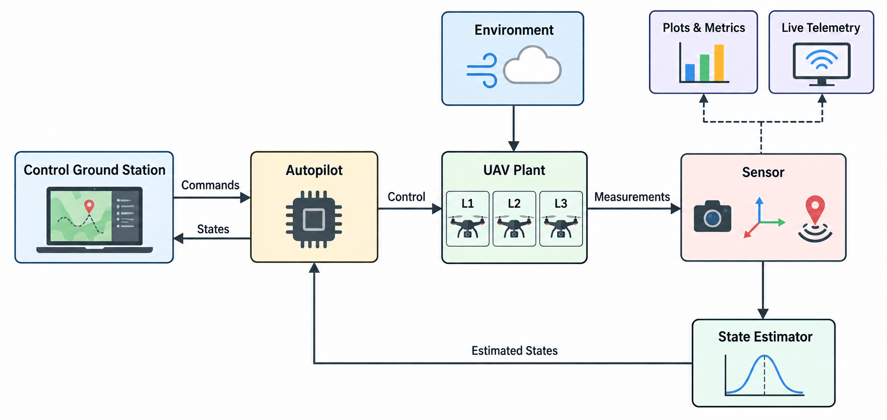

# UAV Research Environment: A Parameter-Consistent Multi-Fidelity Framework for Quadrotor Control Evaluation

<p align="center">
  
  <a href="https://www.mathworks.com/products/matlab.html"></a>
  <a href="https://www.mathworks.com/products/simulink.html"></a>
  <a href="LICENSE"></a>
</p>

---

## Introduction

This repository provides a MATLAB/Simulink environment for evaluating quadrotor controllers across three plant-model fidelity levels while keeping the main experimental conditions as consistent as possible.

The framework compares:

- **L1 — Analytical ODE model**
- **L2 — Simulink block-based model**
- **L3 — Simscape physical model**

The same reference vehicle, controller architecture, estimator, sensors, missions, disturbance conditions, and evaluation methodology are maintained across the plant models whenever possible.

The objective is to study how model fidelity affects closed-loop evaluation results and computational cost.

---

## Framework Overview

The main model is:

```text
UAV_Research_Environment.slx
```

The framework integrates:

- Multi-fidelity plant models
- Cascaded quadrotor control
- Sensor models
- State estimation
- Mission and trajectory generation
- Environmental disturbances
- Landing and ground-contact logic
- Performance logging and visualization

The three plant models share a common high-level architecture so that plant fidelity can be changed without redesigning the complete control and evaluation workflow.

<p align="center">
  
</p>


---

## Demonstration Videos

**Live 3D simulation:** Demonstration of the quadrotor simulation with real-time 3D trajectory visualization and live flight-state monitoring.


https://github.com/user-attachments/assets/d4cd0f30-7b3f-41c5-a28b-6278058ded06


**Simscape Multibody visualization:** Demonstration of the L3 physical model running in Simscape Multibody using Mechanics Explorer.

https://github.com/user-attachments/assets/017d02ad-7967-41f0-a2cc-a38247139f43

---

## Requirements

The framework was developed and tested using **MATLAB R2025a** on Windows 11.

### Required MATLAB Products

- MATLAB
- Simulink
- Simscape
- Simscape Multibody
- Aerospace Toolbox
- Aerospace Blockset
- UAV Toolbox
- Navigation Toolbox
- Control System Toolbox
- Global Optimization Toolbox

`Simscape` and `Simscape Multibody` are required for the L3 physical model, while `Global Optimization Toolbox` is used by the controller and estimator tuning workflows.

---

## Getting Started

Clone this repository using Git.


### Selecting a Trajectory

The trajectory library is defined in:

```text
UAV_trajectories.m
```

Select the desired trajectory by setting `TRAJECTORY_ID` before running the project initialization:

```matlab
TRAJECTORY_ID = uint8(1);
initialize_project
```

The available trajectory IDs are defined directly in `UAV_trajectories.m`.

After initialization, open the main model:

```matlab
open_system('UAV_Research_Environment')
```

Update the model with `Ctrl + D` if required, then press **Run**.

---

## Reproducibility and Technical Configuration

The following configuration was used for the experiments reported in the
paper.

### Experimental Configuration

  Item                       Configuration
  -------------------------- ----------------------------------------
  Primary campaign           L1(C1), L2(C1), L3(C2) × T1/T2 × D0/D1
  Primary runs               12
  Sensitivity runs           L3(C1) on T1-D1 and T2-D1
  Simulation horizon         130 s
  Control/estimation rate    200 Hz
  GPS rate                   10 Hz
  Magnetometer fusion rate   20 Hz
  Barometer rate             20 Hz

T1 and T2 are defined in `UAV_trajectories.m`. Disturbance conditions
and realizations are defined in `Environment.m`.

### Controller Configuration

Two controller tunings are used:

-   **C1:** L1 and L2
-   **C2:** L3
-   **Sensitivity tests:** C1 is transferred unchanged to L3

The numerical controller gains and common saturation limits are defined
in `ICRA_experiment_config.m` and `UAV_autopilot.m`.

### Estimation and Sensors

State estimation uses an `insfilterMARG` Extended Kalman Filter in the
NED reference frame, fusing accelerometer, gyroscope, magnetometer, GPS
position/velocity, and barometer measurements.

Estimator and sensor parameters, including noise models, covariance
tuning, sampling rates, initialization criteria, and random seeds, are
defined in:

-   `UAV_state_estimator.m`
-   `UAV_sensors.m`

### Vehicle and Plant Parameters

The authoritative model parameters are contained in:

  File                 Configuration
  -------------------- -----------------------------------------------
  `UAV_analytical.m`   L1 rigid-body and rotor parameters
  `UAV_block.m`        L2 block-model parameters
  `UAV_simscape.m`     L3 physical/electrical parameters
  `Environment.m`      Gravity, atmosphere, ground, and disturbances

The three models represent the same reference quadrotor wherever their
modeling formulations permit.

### Solver and Computational Environment

  Setting                 Value
  ----------------------- -------------------------
  MATLAB/Simulink         R2025a Update 1
  Operating system        Windows 11
  Computer                Dell Precision 3680
  Processor               Intel Core i9-14900
  Memory                  32 GB RAM
  Solver                  `ode23t`, variable-step
  Maximum step            `2e-3 s`
  Relative tolerance      `1e-4`
  Absolute tolerance      `1e-3`
  Simscape local solver   OFF
  Simulation mode         Normal

Computational-cost measurements were performed with Fast Restart and
simulation pacing disabled.

### Reproducing the Campaign

The intended campaign interface is:

``` matlab
CFG = ICRA_experiment_config;
CAMPAIGN = run_icra_campaign;
```

For an individual experiment:

``` matlab
CFG = ICRA_experiment_config;
RUN = run_icra_experiment(CFG,runNumber);
```

The campaign configuration follows the paper mapping **C1 → L1/L2** and
**C2 → L3**, with C1 transferred to L3 only for the two supplementary
sensitivity runs.


---

## Study Summary and Main Finding

This framework was developed to investigate whether increasing plant-model fidelity changes controller-evaluation conclusions when the rest of the benchmark is kept as consistent as possible.

Three progressively more detailed plant models were implemented and evaluated within the same MATLAB/Simulink environment using a common control, estimation, sensing, mission, and analysis architecture.

The main conclusion is:

> **The appropriate simulation fidelity is task-dependent. Higher fidelity is not automatically the best choice for every controller-evaluation problem.**

Lower-fidelity models are useful for fast controller development, tuning, repeated testing, and large simulation campaigns. Higher-fidelity models become more valuable when the evaluation depends on physical effects that are not represented by simpler models, such as actuator dynamics, electrical behavior, multibody effects, or detailed ground interaction.

The purpose of the framework is therefore not to identify one universally superior model, but to support systematic evaluation of when additional physical fidelity provides enough value to justify its additional computational cost.

---

## 3D Model Reference

The 3D quadrotor model used for the **Simscape** representation was adapted from the **UNI-350CL** model provided by the UniQuad project:

https://hkust-aerial-robotics.github.io/UniQuad/

---

## License

This project is licensed under the Apache License 2.0. See the [LICENSE](LICENSE) file for details.

---

## Preliminary Release Notice

This repository is an initial functional research release and should be considered a working research snapshot rather than a final software distribution. The repository is provided primarily to document and reproduce the current research workflow. Future versions may include corrections, refinements, additional validation, and improvements to usability and documentation.
